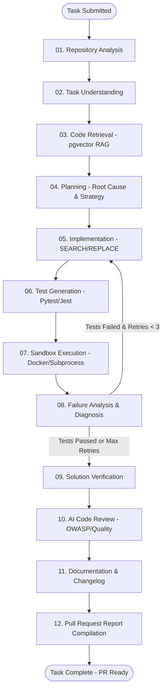

# Autonomous AI Software Engineer 🤖🚀

[]()
[]()
[]()
[]()
[]()
[]()
[]()

An enterprise-grade, fully autonomous AI software engineering system capable of ingesting entire codebases, semantically indexing symbols with AST & pgvector RAG, formulating architectural plans via LangGraph, applying surgical `SEARCH/REPLACE` code modifications, executing tests in an isolated Docker sandbox with automated self-correction loops, performing security audits (OWASP), and compiling production-ready Pull Request markdown reports.

---

## 🏗️ Architecture & 12-Node Autonomous Workflow



---

## ✨ Key Capabilities Across 10 Phases

1. **Phase 1 — Core Architecture & Scaffolding**: Monorepo structure, async FastAPI, 11 PostgreSQL ORM tables, Alembic migrations, Groq/OpenAI provider abstractions.
2. **Phase 2 — GitHub Repository Ingestion & AST Analysis**: GitPython ingestion, token masking, 30+ language scanner, tree-sitter AST symbol extractor, interactive FileTree.
3. **Phase 3 — Code Intelligence & Codebase RAG**: AST-guided semantic chunker, batch embeddings, pgvector cosine similarity + symbol match retriever.
4. **Phase 4 — LangGraph Agent & Task Planning**: Multi-node LangGraph state machine (`AgentState`), structured JSON planning, real-time Server-Sent Events (SSE) streaming.
5. **Phase 5 — Code Modification & Patch Tools**: Surgical `SEARCH/REPLACE` diff engine, line ending normalization, atomic `.bak` backup/restore manager, syntax-highlighted DiffViewer.
6. **Phase 6 — Automated Test Generation & Sandbox Execution**: Framework detector (`pytest`, `jest`, `unittest`), LLM test generator, isolated Docker sandbox runner with CPU/memory/timeout limits, structured test output parser, TestResultsViewer.
7. **Phase 7 — Failure Analysis & Self-Correction Retry Loop**: Error categorizer (`syntax_error`, `import_error`, `assertion_failure`, `missing_dependency`), root cause diagnostician, automated 3-attempt self-correction loop, solution verifier.
8. **Phase 8 — AI Code Review & Pull Request Report Generation**: Autonomous security/quality auditor (`high`, `medium`, `low`, `info`), documentation agent, GitHub/GitLab PR Markdown generator with diffs and metrics.
9. **Phase 9 — Frontend Dashboard Polish & Visual Experience**: System metrics overview, instant task search, prompt presets, dark developer UI theme, 5-tab workspace.
10. **Phase 10 — Production Hardening & E2E Verification**: Comprehensive 12-node end-to-end integration test suite, connection pooling, and production documentation.

---

## ⚡ Quick Start & Running Guide

### Method 1: Local Development Mode (Recommended)

In this mode, PostgreSQL (with pgvector) runs inside Docker, while the FastAPI backend and React frontend run directly on Windows/macOS/Linux.

#### 1. Start the Database
```powershell
docker compose up -d postgres
```

#### 2. Start the Backend API
```powershell
cd backend
python -m uvicorn app.main:app --reload --port 8000
```
- API Base: `http://localhost:8000`
- Interactive Swagger Docs: `http://localhost:8000/docs`

#### 3. Start the Frontend Dashboard
```powershell
cd frontend
npm run dev
```
- Dashboard UI: `http://localhost:5173`

---

### Method 2: Full Docker Compose

Run all services (Database, Backend, Frontend, and Sandbox) in isolated containers:
```powershell
docker compose up --build
```

---

## ⚙️ Environment Configuration (`.env`)

```env
# Application
APP_NAME="Autonomous AI Software Engineer"
APP_VERSION="0.1.0"
ENVIRONMENT=development
DEBUG=true

# Database (pgvector)
POSTGRES_HOST=localhost
POSTGRES_PORT=5432
POSTGRES_DB=ai_engineer
POSTGRES_USER=ai_engineer
POSTGRES_PASSWORD=changeme

# LLM Provider Configuration (Groq / OpenAI)
LLM_PROVIDER=openai
LLM_BASE_URL=https://api.groq.com/openai/v1
LLM_MODEL=llama-3.3-70b-versatile
OPENAI_API_KEY=gsk_your_groq_api_key_here

# Embedding Configuration
EMBEDDING_PROVIDER=openai
EMBEDDING_BASE_URL=https://api.groq.com/openai/v1

# Workspaces
WORKSPACE_BASE_DIR=/tmp/ai-engineer-workspaces
```

---

## 🧪 Running the Test Suite

```powershell
# Backend Unit & Integration Tests (64 passing tests)
cd backend
python -m pytest tests/unit/ tests/integration/ -v

# Frontend TypeScript Verification & Bundle Build
cd frontend
npm run build
```

---

## 📊 API Endpoint Catalogue

| Method | Endpoint | Description |
| :--- | :--- | :--- |
| `GET` | `/api/health` | System health check (DB, LLM status) |
| `POST` | `/api/repositories/analyze` | Ingest and analyze a GitHub repository |
| `GET` | `/api/repositories` | List all ingested repositories |
| `GET` | `/api/repositories/{id}/tree` | Get repository file tree |
| `POST` | `/api/repositories/{id}/index` | Index repository into pgvector RAG |
| `POST` | `/api/repositories/{id}/search` | Semantic codebase search |
| `POST` | `/api/tasks` | Create and launch autonomous engineering task |
| `GET` | `/api/tasks` | List all engineering tasks |
| `GET` | `/api/tasks/{id}` | Get full task details and execution plan |
| `GET` | `/api/tasks/{id}/logs` | Stream live agent execution logs via SSE |
| `GET` | `/api/tasks/{id}/diff` | Get unified Git diff of workspace changes |
| `GET` | `/api/tasks/{id}/tests` | Get test execution run history |
| `GET` | `/api/tasks/{id}/review` | Get AI security & quality code review findings |
| `GET` | `/api/tasks/{id}/report` | Get final Pull Request Markdown report |

---

## 📄 License
MIT License. Built with ❤️ by the Autonomous AI Engineering Team.
